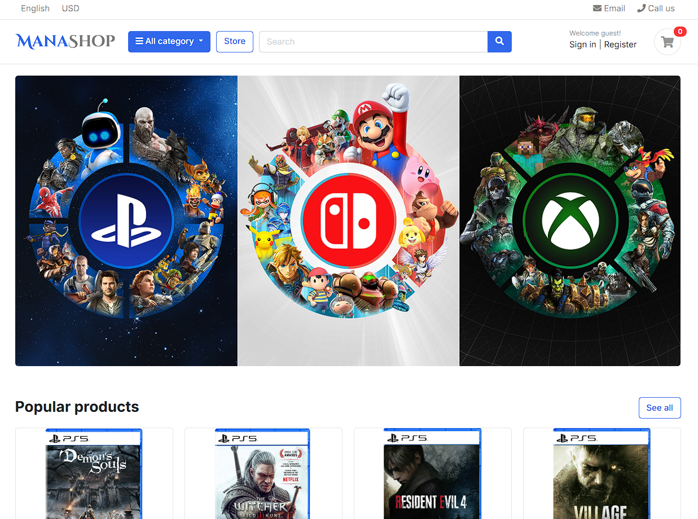

# 🛒 E-commerce

A **reusable Django e-commerce platform** tailored for **game shops**, built to serve as a solid foundation for future stores and experiments.

The system is split into independent layers, making it easy to extend or reuse in other projects.

- 🎮 **Shop Layer** → Game-focused products & categories
- 🛒 **E-commerce Core** → Reusable cart, orders, payments & users
- ⚙️ **Backend** → Built with **Django**

<div align="center">
  <p float="left">
    
  </p>
</div>

## Getting Started

### 1️⃣ Clone the repository

```bash
git clone https://github.com/AppRonin/ecommerce.git
cd ecommerce
```

### 2️⃣ Create virtual environment

```bash
python -m venv env
source env/bin/activate   # Linux / macOS
env\Scripts\activate      # Windows
```

### 3️⃣ Install dependencies

```bash
pip install -r requirements.txt
```

### 4️⃣ Run the server

```bash
python manage.py runserver
```

## Author

Developed by AppRonin, Full-Stack Developer.
